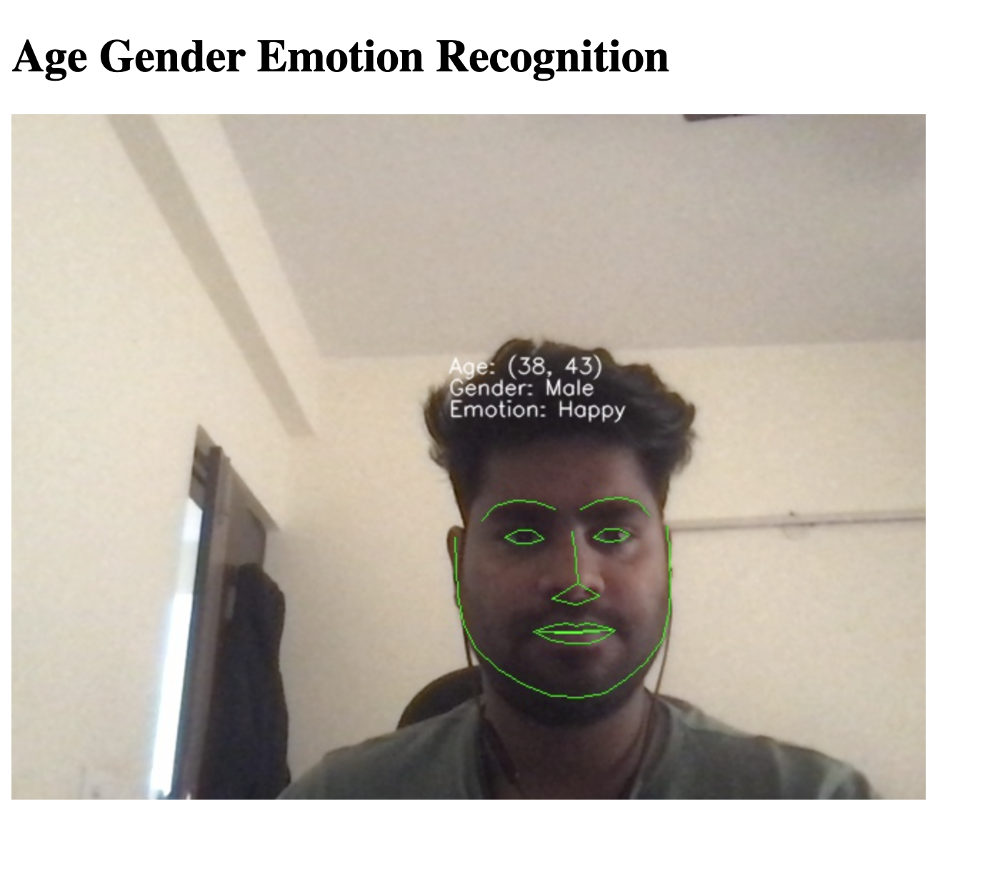

<h2>Real-Time Face Pose/Age/Gender/Emotion Estimation</h2>

---

Detect detailed data for people’s gender, age and emotions and build engaging experiences.

  

--- 

## Gender estimation

  

There are certain common features in human faces that distinguish male faces from female ones. FaceAnalysis uses advanced machine learning techniques to provide you with gender detection.

---

## Age estimation

Landmarks such as the location of the pupils, eye corners, lip boundaries, etc. change with age. Our algorithm was trained on a large database of different faces to detect the approximate age of a person based on such features.

---

## Emotion estimation

  

Emotion estimation detects facial expressions from videos and returns the probability distribution of each of the six universal emotions: happiness, sadness, anger, fear, surprise, and disgust, and additionally neutral.